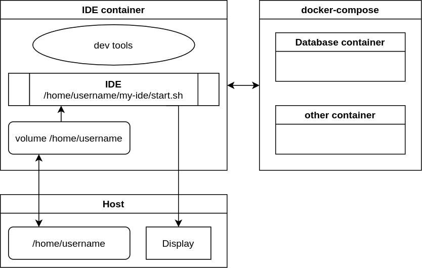

# IDE in Docker

A script to run IDE in docker container (via [x11docker](https://github.com/mviereck/x11docker))

&plus; [docker images](https://hub.docker.com/r/01e9/ide-in-docker/tags) with GUI and development packages

<details><summary>Diagram</summary></details>

## Usage

See `./ide-in-docker --help`

### Connect to other containers

To connect to databases/queues/etc.

1. Create a `docker-compose.yaml` and start it `docker-compose up -d`
2. Find the network created by compose `docker network ls`
3. Start the IDE container in the same network
    ```shell
    env DOCKER_OPTS='--network=my_compose_network' ./ide-in-docker ...
    ```

## Create your docker image

See `dockerfiles/` for examples.
